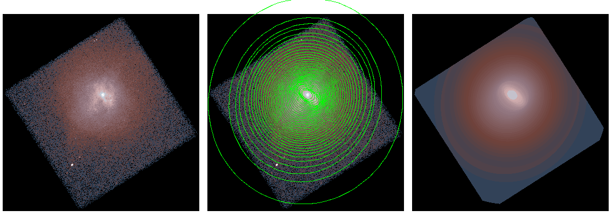
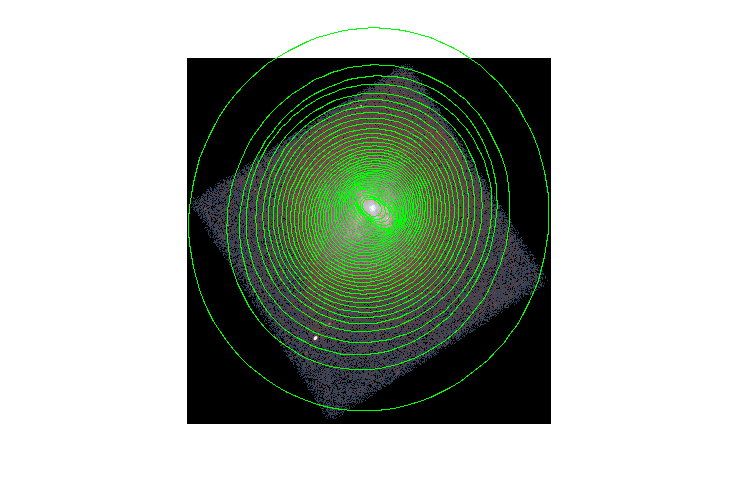
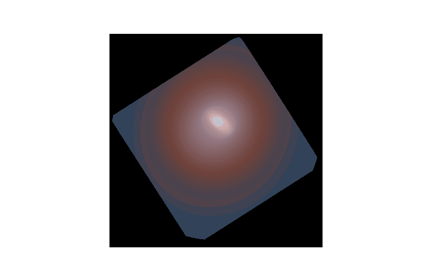

# Elliptical model

This script takes the output from the [CIAO](http://cxc.cfa.harvard.edu/ciao/index.html)
[dmellipse](http://cxc.cfa.harvard.edu/ciao/ahelp/dmellipse.html) tool
and uses it to create a model image.

## Example

### Run `dmellipse`

We start by running `dmellipse` to create an ellipse profile of 
the image.  `dmellipse` takes the input image `img.fits` and a 
[stack](http://cxc.cfa.harvard.edu/ciao/ahelp/stack.html) of 
integrated fractions.  

```bash
dmellipse img.fits ellipses.fits fraction="lgrid(0.05:1.0:0.025)" step=20 mode=h clob+
```

This example generates the ellipse profile which enclose from 5% to 100%
of the total flux in the image, in steps of 2.5%.  The `step` parameter is
increased to match the scale of the image which allows the tool to run
faster.

```bash
ds9 img.fits -region ellipses.fits -scale log \
  -cmap load ~/ds9_hacks/LUT/Neota/neota_sunset-in-atlantis.lut \
  -view colorbar no  -saveimage png ellipses.png -quit
```




### Reconstruct using `emodel`

Now we will reconstruct a model of the image based on the 
ellipse profile

```bash
emodel ellipses.fits img.fits model.fits weight=flat clob+ 
```

`emodel` takes the information about the ellipses and the fraction 
of the total flux in each ellipse to reconstruct a 2D model.  The `weight`
parameter controls how the flux is distributed within the ellipse.  The
default `flat` equally distributes the flux into each pixel in the ellipse.


```bash
ds9 model.fits -scale log \
  -cmap load ~/ds9_hacks/LUT/Neota/neota_sunset-in-atlantis.lut \
  -view colorbar no  -saveimage png model.png -quit
```




### Weights

**Experimental**

The `weight` option is still experimental.  The `flat` and `linear` 
are well behaved but the other options may produces some artifacts, 
especially at the boundary between ellipses.

```bash
emodel ellipses.fits img.fits model_flat.fits weight=flat clob+ 
emodel ellipses.fits img.fits model_linear.fits weight=linear clob+ 
emodel ellipses.fits img.fits model_gaussian.fits weight=gaussian clob+ 
emodel ellipses.fits img.fits model_square.fits weight=square clob+ 
emodel ellipses.fits img.fits model_sqrt.fits weight=sqrt clob+ 
emodel ellipses.fits img.fits model_hemi.fits weight=hemi clob+ 
```

The effect of the weighting is most obvious in the center of the
image


```
ds9 model_flat.fits -scale log -zoom 4 -tile -view colorbar no\
  -cmap load ~/ds9_hacks/LUT/Neota/neota_sunset-in-atlantis.lut \
  model_linear.fits model_gaussian.fits model_square.fits model_sqrt.fits model_hemi.fits \
  -pan to 4270 3960 physical -match frames physical \
  -saveimage png weights.png -quit
```


## To Do

- [] Implement image subspace and NULL/NaN value checking to remove/respect the white space around the image.
